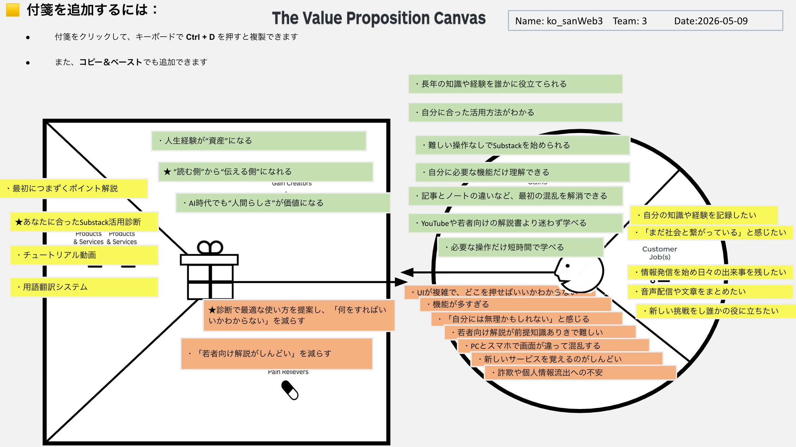

# VPC v1

## Customer Profile (顧客プロフィール)
**Customer Jobs (顧客のジョブ):**
- 自分の知識や経験を記録したい
- 「まだ社会と繋がっている」と感じたい
- 情報発信を始め日々の出来事を残したい
- 音声配信や文章をまとめたい
- 新しい挑戦をし誰かの役に立ちたい

**Pains (ペイン):**
- UIが複雑で、どこを押せばいいかわからない
- 機能が多すぎる
- 「自分には無理かもしれない」と感じる
- 若者向け解説が前提知識ありきで難しい
- PCとスマホで画面が違って混乱する
- 新しいサービスを覚えるのがしんどい
- 詐欺や個人情報流出への不安

**Gains (ゲイン):**
- 長年の知識や経験を誰かに役立てられる
- 自分に合った活用方法がわかる
- 難しい操作なしでSubstackを始められる
- 自分に必要な機能だけ理解できる
- 記事とノートの違いなど、最初の混乱を解消できる
- YouTubeや若者向けの解説書より迷わず学べる
- 必要な操作だけ短時間で学べる

## Value Map (バリューマップ)
**Products & Services (製品・サービス):**
- 最初に躓くポイント解説
- ★あなたに合ったSubstack活用診断
- チュートリアル動画
- 用語翻訳システム

**Pain Relievers (ペインリリーバー):**
- ★診断で最適な使い方を提案し、「何をすればいいかわからない」を減らす
- 「若者向け解説がしんどい」を減らす

**Gain Creators (ゲインクリエイター):**
- 人生経験が”資産”になる
- ★”読む側”から”伝える側”になれる
- AI時代でも”人間らしさ”が価値になる
